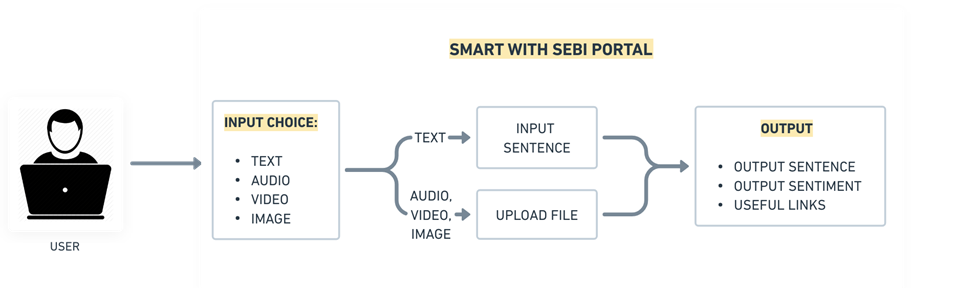

# Empowering-Investors-Hackathon

## Submission Instruction:
  1. Fork this repository
  2. Create a folder with your Team Name
  3. Upload all the code and necessary files in the created folder
  4. Upload a **README.md** file in your folder with the below mentioned informations.
  5. Generate a Pull Request with your Team Name. (Example: submission-XYZ_team)

## README.md must consist of the following information:

#### Team Name - Emperor
#### Problem Statement - Misleading Claim Detection & Content Curation
#### Team Leader Email - hindeshnit19@gmail.com

## A Brief of the Prototype:
  

  Working:

  1. There are two separate portals, one for common user which includes claim detection and educational content generation and other for SEBI personnel for claim detection and features like source reliability rating.

  2. At-first any user inputs TEXT/AUDIO/VIDEO/IMAGE (currently only upload is supported, Web Scraping is reserved for future use-case) then the input is converted to text first.

  3. The text prompt is passed through OpenAI's whisper-1 model with precise prompt to output whether is claim is misleading or not, and based on certain financial points, suppose the input is:
        "Invest into company A, which is giving good returns."
        Certain financial keywords: invest, returns are extracted and then based on these key words, videos from YouTube are suggested to the user.

  4. **MOST IMPORTANT FEATURES for SEBI Personnel:** 

      4.1. Based on the input claim, certain rules and regulations are also suggested based upon mapping from the financial concept to the SEBI rules and regulations database.\

      4.2. A source reliability rating database in the form of Google Sheets is connected to the app so that whenever any claim is being judged, it is pushed to tha database (Google Sheet) and a score is marked for each claim type: -1 for MISLEADING and +1 for NOT MISLEADING, based on the cumulative scores a ranking is assigned and displayed.

  
## Tech Stack: 
   Following technologies were used:\
      1. Streamlit - for web-development\
      2. HuggingFace - for sentiment analysis pipeline\
      3. LangChain - For accessing OpenAI \
      4. PyTesseract - for Optical Character Recognition\
      5. pydub - for audio segmentation\
      6. moviePy - for detaching audio from video\
      7. GoogleSheets - for backend database\
   
## Step-by-Step Code Execution Instructions:
  1. clone the repository:

  
## What I Learned:
   Write about the biggest learning you had while developing the prototype
