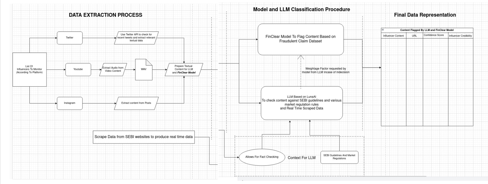

# FinClear

### Team Name
Those It Guys
### Problem Statement
Identifying Misleading Claims Made by Influencers
#### Team Leader Email
udaybeswal@gmail.com

## Brief of the Prototype

### Objective

This project prototype addresses the issue of misleading claims made by influencers, particularly in the financial domain.

### Final Software UML

### Prototype Overview
Prototype currently contains a Front-End made using `Streamlit`.The frontend takes a youtube url and the name of the influencer(just for demonstartion purpose) as the input and upon pressing the check button a multi-stage pipeline is triggered. Along with the pipeline a seperate check is run to check if an influencer is registered under SEBI or not. Since no such data was available publicly we are using a custom csv file. 

#### 1. Video to Audio Conversion
- **Input**: YouTube URL
- **Action**: Uses `yt_dlp` to extract the audio and generate a .wav file from the video.

#### 2. Automatic Speech Recognition (ASR)
- **Input**: .wav audio file 
- **Action**: Utilizes the `speech_recognition` library to perform ASR on the audio, transcribing spoken words into text.

#### 3. Text Embeddings
- **Input**: Extracted text 
- **Action**: Generates embeddings of generated text using a Doc2Vec model trained on the `Sentiment Analysis for Financial News` dataset from Kaggle. These embeddings represent the content's context.

#### 4. Financial Advice Detection Model
- **Input**: Text embeddings
- **Action**: Feeds embeddings into the Fin_Advise_Model, which predicts whether the influencer is giving financial advice. Achieves an accuracy of `74.3%` using a Random Forest Classification model. The dataset for this model was generated through prompt engineering with the help of chatGPT.

## Tech Stack

#### FRONTEND
Streamlit

#### ML Models / Pipeline
Gensim - Doc2Vec 

Sklearn -Random Forest Classifier 
    
#### Transformer 
Llama-Luna AI 7B model (For Hinglish Translation)

#### External Tools
yt_dlp

ffmpeg

Hugging Face (Wav2Vec2ForCTCWav2Vec2Tokenizer)

#### Datasets
    
Doc2Vec Trained on
[Kaggle sentiment-analysis-for-financial-news](https://www.kaggle.com/datasets/ankurzing/sentiment-analysis-for-financial-news)

Financial Advice Detector Model trained on [Dummy dataset](https://docs.google.com/spreadsheets/d/18hHYe4lsV5G01VWhHLSHGkhaH6F7u0jMnkQKCdvlLCk/edit?usp=sharing
)

## Step By Step instructions to run locally

Prerequisites:
 - python
 - pip
 - A linux environment

 For the modules you can install both via pip:

1) `pip install yt-dlp`

2) `pip install ffmpeg-python`

3) **NOTE** : To run the project successfully you need to create a .env file in the root of the project with a variable name  `PWD=<present working directory>`

To run the project first install the necessary requirements using:

4) Create a virtual environment using 
`pip install virtualenv` and then `virtualenv env`

5) Activate the virtual env `source env/bin/activate`

6) `pip install -r requirements.txt` (Prefer a virtual environment for the same)

And run:

7) `streamlit run website.py`

This would open up a web interface where you can provide the URL of the youtube video and the name of the influencer. 

Once you click the submit button it will trigger the model pipeline and check the content for any fraudlent claims and whether or not the particular influencer is registered or not. 

This will take some time according to the length of the video provided and display the results on the same page.

## Learnings gained from this task

- **Data Diversity Matters**: We discovered the critical importance of having a diverse and comprehensive dataset for training our model. It allowed us to capture a wider range of fraudulent behaviors.

- **Feature Selection is Key**: Careful selection of features, including traditional financial indicators and emerging behavioral patterns, played a crucial role in the model's effectiveness. This balance helped in identifying both known and novel fraud attempts.

- **Staying Vigilant for New Tricks**: The landscape of financial fraud is constantly evolving. We learned that we must continually monitor and adapt our model to detect and prevent new tricks and tactics employed by fraudsters.

- **Ethical Considerations**: Dealing with sensitive financial information requires the utmost ethical standards. We made sure that our system adheres to strict ethical guidelines, ensuring the privacy and security of individuals' financial data.

- **Fairness and Transparency**: We emphasized fairness and transparency in our system's operations. It's crucial that our model's decisions are clear and unbiased to protect innocent individuals from being wrongly flagged as fraudulent.

## Future Aspects
We have developed a separate model to convert the general hinglish text to english so that our model can easily work with the data. 

It has been added in the current codebase but was not shown in the demo video for simplicity. To perform this conversion we are using generative AI capabilities of LunaAI - 7B LLM using python-llama.

We are going to implement a stock analaysis model which checks the stocks mentioned in a video for any anomallies in volume, price and validity(i.e. registration under SEBI).

Currently we have only implemented a model to check for fraudulent claims but as we go forward we are going to add separate analysis models with weighted outputs that will be combined to give a final prediction.

## Authors

- [Ikshan Bhardwaj](https://github.com/ikshan-Tango/)
- [Akshat Jaimini](https://github.com/destrex271)
- [Utkarsh Tripathi](https://www.github.com/octokatherine)
- [Uday Beswal](https://github.com/udbe)

