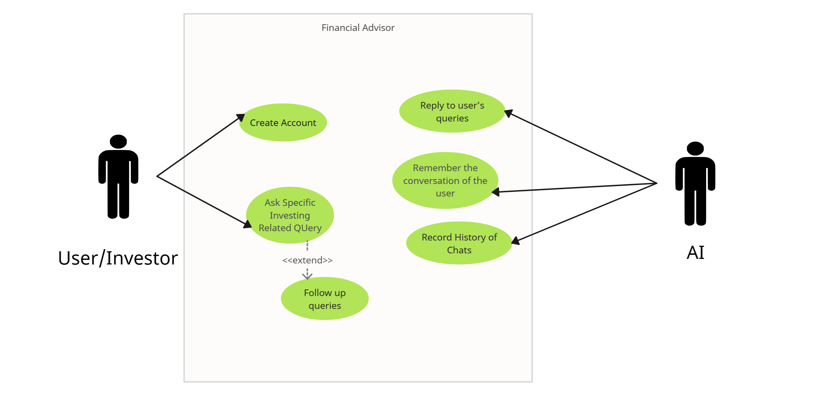

#### Team Name - N-RAM
#### Problem Statement - A 3D AI interface for personalized, trustworthy education on securities markets, empowering investors to navigate financial decisions
#### Team Leader Email - ashishlal4twitter@gmail.com

## A Brief of the Prototype:
  At the prototype level:

- We offer an immersive speech based solution where users can have 
- Interactive conversation with the AI model
- The model as a personalized AI companion that helps in portfolio specific way based on the user queries to- optimize their financial understanding.
- The knowledge of current insights and trends of the market.
- Comfort of limited typing ability or prefer verbal communication.
- discover new investment opportunities and strategies
- More market experience with each interaction
- Get Tip of the day to learn more everyday.
- All the interactions are saved so that every next conversation could be more personalised to the user than before.
Further, we have planned to include a points based system where each interaction gives more user specific experience (exp) points. The model will also provide external links to get more insights on the given scenario as a reference.

Use Case Diagram:



  
## Tech Stack: 
- WhisperAI
- PaLM API
- OAuth
- ThreeJS
- Vite + React
- TailwindCSS
- TypeScript
- NodeJS
- ExpressJS
- MongoDB
   
## Step-by-Step Code Execution Instructions:
- Clone the repository using 
```
git clone https://github.com/ashishlal2003/Empowering-Investors-Hackathon.git
```
- ```cd nram```
- Request for the ```.env``` file from the project manager - ashishlal4twitter@gmail.com
- Place the file in the ```server``` folder.
- By default, in VSCode, the web-app starts automatically through the in-built terminal. It can be directly then accessed on ```localhost:3000```.
- If not, run the following commands:
Open two terminal windows
1. ```  cd client && npm install && npm run dev ```
2. ```   cd server && npm install && npm start ```
  
## What I Learned:
    We as a team learnt a lot of aspects of project development through this hackathon. Some of them include:
- Implementation of Generative AI (using PaLM model API by Google)
- Implementation of ThreeJS (for the 3d avatar)
- Understanding the securities market and what a user can expect to learn.
- Collaboration
- Leadership
- Resolving internal conflicts
- Time management
- Prioritisation